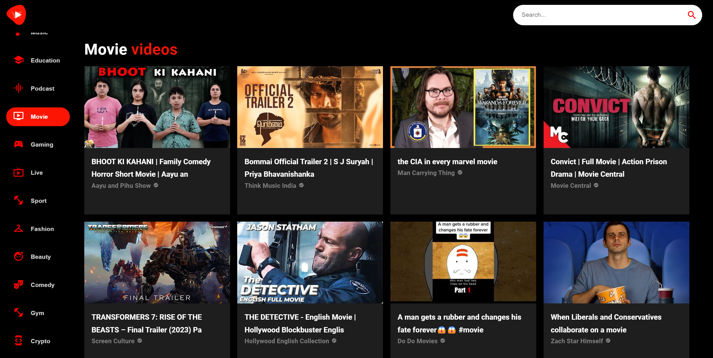
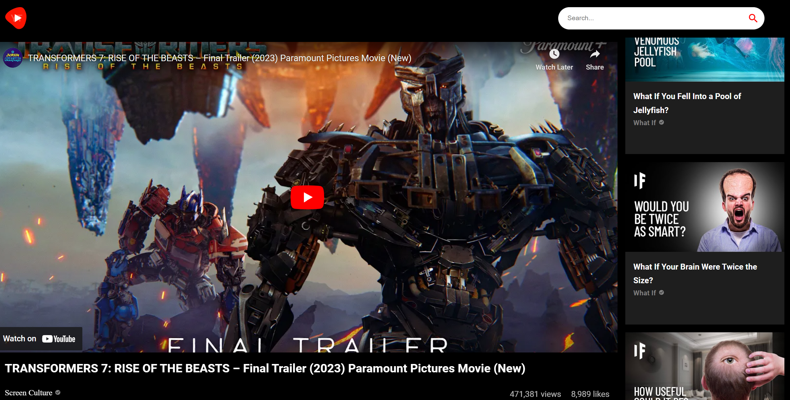
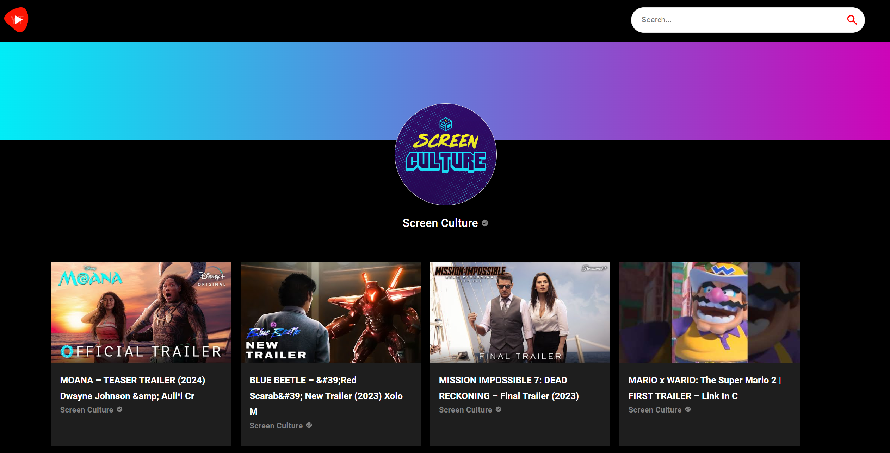
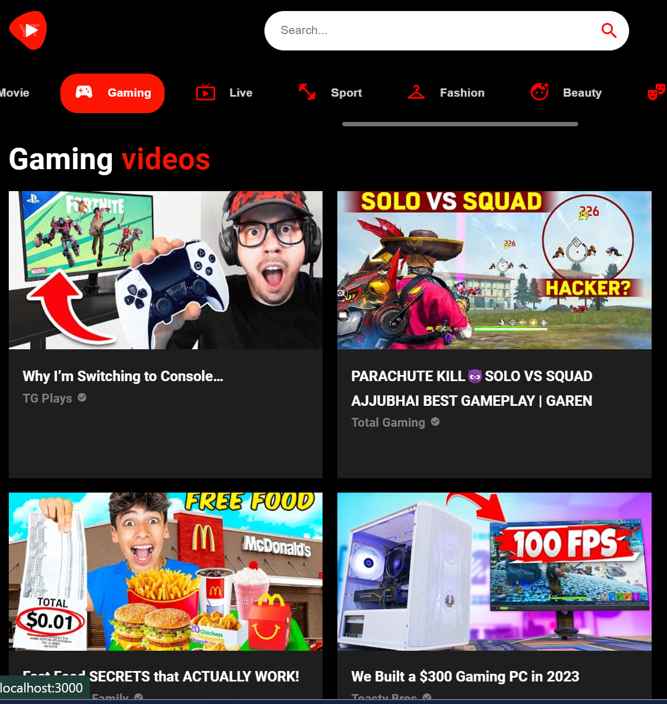

# React.js-MaterialUI-VideoApp

## Table of content

&nbsp;&nbsp;&nbsp; [About Project](#about-project)\
&nbsp;&nbsp;&nbsp; [Screenshots](#screenshots)\
&nbsp;&nbsp;&nbsp; [Technologies Used](#technologies-used)\
&nbsp;&nbsp;&nbsp; [Prerequisites](#prerequisites)\
&nbsp;&nbsp;&nbsp; [Installation](#installation)\
&nbsp;&nbsp;&nbsp; [Usage](#usage)\
&nbsp;&nbsp;&nbsp; [Acknowledgments](#acknowledgments)

## About Project

This is a React.js and Material UI based video app that using [Youtube v.3 API](https://rapidapi.com/ytdlfree/api/youtube-v31).

## Screenshots

Main screen

Video screen

Channel screen

Mobile version

## Technologies Used

- React.js
- MaterialUI
- React Router
- React Player
- Axios

## Prerequisites

You will need to have Node.js and npm installed on your machine.

## Installation

To get started with this project, follow the steps below:

1. Clone the repository to your local machine:\
   &nbsp;&nbsp;&nbsp;&nbsp;&nbsp;&nbsp; `git clone https://github.com/yshvchnk/React.js-MaterialUI-VideoApp.git`

2. Navigate to the project directory:\
   &nbsp;&nbsp;&nbsp;&nbsp;&nbsp;&nbsp; `cd React.js-MaterialUI-VideoApp`

3. Get your [API key](https://rapidapi.com/ytdlfree/api/youtube-v31) and set up environment variables

4. Install dependencies:\
   &nbsp;&nbsp;&nbsp;&nbsp;&nbsp;&nbsp; `npm install`

5. Start the development server:\
   &nbsp;&nbsp;&nbsp;&nbsp;&nbsp;&nbsp; `npm start`

## Usage

Once you have started the development server, open a web browser and navigate to localhost to view the application.

The page will reload when you make changes.\
You may also see any lint errors in the console.

## Acknowledgments

This project was bootstrapped with [Create React App](https://github.com/facebook/create-react-app).
